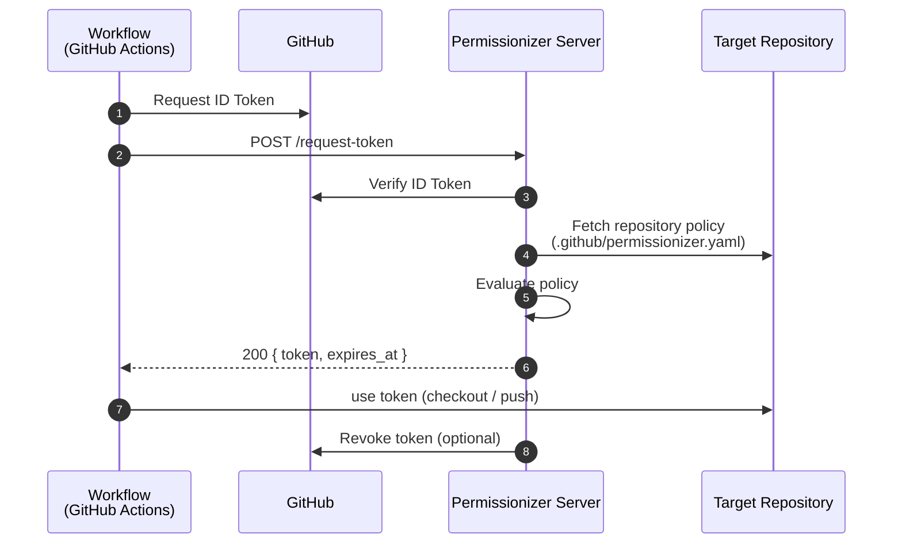

# Permissionizer

Permissionizer is a GitHub App that helps writing cross-repository GitHub Actions workflows by issuing short-lived, policy-based tokens as an alternative to individual Personal Access Tokens (PATs) or custom GitHub apps with broad permissions.

With Permissionizer you can easily define a policy to allow other repositories to request scoped tokens with only the permissions required. For example, you can allow a `foo-service` repository to update the manifests in the `foo-service-manifests` repository:
```yaml
# Permissionizer policy in `my-org/foo-service-manifests` repository
self: my-org/foo-service-manifests
allow:
  - repository: my-org/foo-service
    permissions:
      contents: write
```
The `foo-service` repository can then request a token with `contents: write` permission to update the manifests:
```yaml
# Workflow in `my-org/foo-service` repository
name: Update deployment manifests
on:
  tag: v*

permissions:
  id-token: write # Required to verify the repository identity

jobs:
  update-deployment-manifests:
    runs-on: ubuntu-latest
    steps:
      - name: Request token from Permissionizer
        id: request-token
        uses: permissionizer/request-token@v1
        with:
          target-repository: my-org/foo-service-manifests
          permissions: |
            contents: write

      - name: Checkout manifests repository
        uses: actions/checkout@v5
        with:
          repository: my-org/foo-service-manifests
          token: ${{ steps.request-token.outputs.token }}
          ref: main

      - name: Update deployment manifests for version ${{ github.ref }}
        run: |
          ... update manifests logic here ...

          git commit -am "Update manifests for $GITHUB_REF"
          git push origin main
```

## How does it work?

Permissionizer App acts as an [OIDC provider](https://docs.github.com/en/actions/security-for-github-actions/security-hardening-your-deployments/about-security-hardening-with-openid-connect) between GitHub repositories. While Permissionizer App itself has broad permissions to your repository (or an organization), it only issues short-lived tokens with the permissions explicitly allowed by a policy defined in the target repository.

When a workflow in a repository (e.g. `foo-service`) wants to access another repository (e.g. `foo-service-manifests`), it uses the `permissionizer/request-token` action to request a token from the [Permissionizer Server](https://github.com/permissionizer/server) (available for free as cloud version and for [self-hosting](https://github.com/permissionizer/server?tab=readme-ov-file#custom-deployment)). The action provides an ID token (requires `id-token: write` permission) that proves the identity of the requesting repository. The server verifies the ID token and checks the policy in the target repository to see if the requesting repository is allowed to request a token with the specified permissions. If the request is allowed, a short-lived token with the requested permissions is issued, which can then be used to access the target repository.



## Why not use PATs or custom GitHub Apps?

The only way to access another repository in GitHub Actions is to use a Personal Access Token (PAT) or a GitHub App. The problem with those is that they are usually long-lived and often have broad permissions. Such tokens (or app private keys) need to be shared across all repositories, which poses a security risk. If a token is compromised, an attacker can gain access to all repositories that the token has access to.

Even if handled correctly, managing multiple PATs or GitHub Apps using different sets of permissions and installations to required repositories becomes difficult to manage. With Permissionizer, there is only a single GitHub App to manage, and the permissions are scoped by explicitly declaring access policies in every repository that should be given access to.

## Zero Trust Policy

Tokens can only be issued if explicitly allowed by the target repository's policy, ensuring strict access control. The identity of the workflow in the requesting repository as well as the allowed access policy is verified by the [Permissionizer Server](https://github.com/permissionizer/server). This process is seamlessly managed by the`permissionizer/request-token@v1` action.

Permissioniezr access policy is defined in a `.github/permissionizer.yaml` file in the target repository and has wide flexibility to define which repositories are allowed to request tokens and with which permissions. The policy can also restrict token requests to specific branches or workflows in the requesting repository.

```yaml
self: my-org/foo-service-manifests
allow:
  # (required)
  # Repository requesting the token
  - repository: my-org/foo-service
    # (required)
    # Permissions that can be requested by `permissionizer/server`
    # Only permissions listed here are allowed to be requested
    # Requester can always request a subset of the allowed permissions or lower access
    # (i.e. requesting only `issues: read` when allowed `contents: write`, `issues: write`)
    # see all available permissions
    # https://docs.github.com/en/authentication/keeping-your-account-and-data-secure/managing-your-personal-access-tokens#repository-permissions
    permissions:
      contents: write
      secrets: read
    # (optional)
    # Restricts requesting token to specific branches (refs) of the requesting repository
    # Accepts short and full formats of `ref` (e.g. `main`. `refs/heads/main`, `refs/tags/v1.0.0`, `refs/tags/v*`)
    ref: main
    # (optional)
    # Restricts requesting token only from a specific workflow of the requesting repository
    # Also allows specifying a ref to a shared workflow, e.g. my-org/reusable-workflows/.github/workflows/release.yaml@refs/heads/main
    workflow_ref: .github/workflows/release.yaml
```

Following this policy, only the `my-org/foo-service` repository is allowed to request a token with access to the `my-org/foo-service-manifests` repository. The issued token will have `contents: read`, `secrets: write`, and a default `metadata: read` permissions.

In the example above, to harden the security, the policy requires the requesting workflow to run from the `main` branch. Additionally, it restricts requesting the token to the `release.yaml` workflow only, so that the token cannot be issued from any other workflow within `my-org/foo-servicer` and not from other branches or pull requests.
